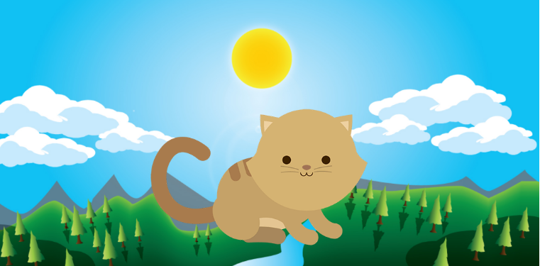
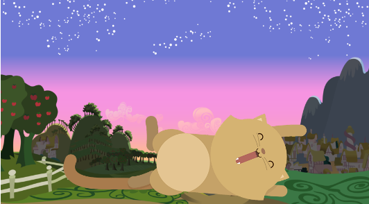

## 1. Reto de código : Kitten

##### Crea una página web donde se muestre un paisaje y un gatito diferente a medida que la ventana del navegador se haga más pequeña.

APROXIMADAMENTE 1200px

 APROXIMADAMENTE 800px

 APROXIMADAMENTE 600px

